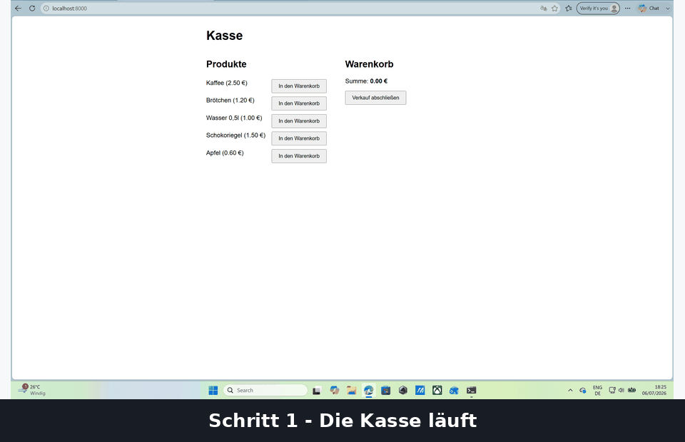
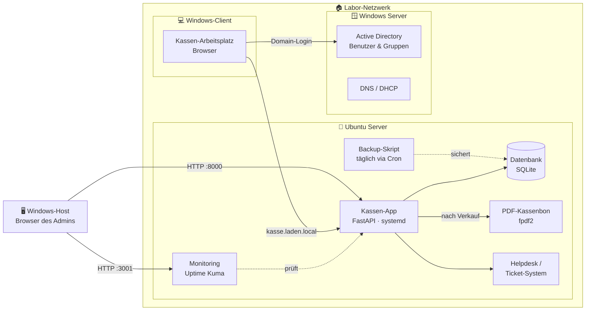
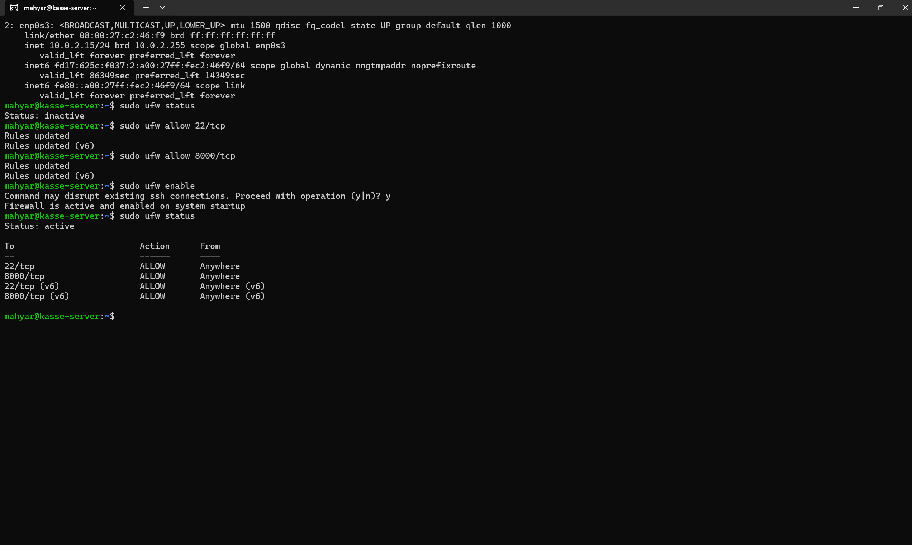
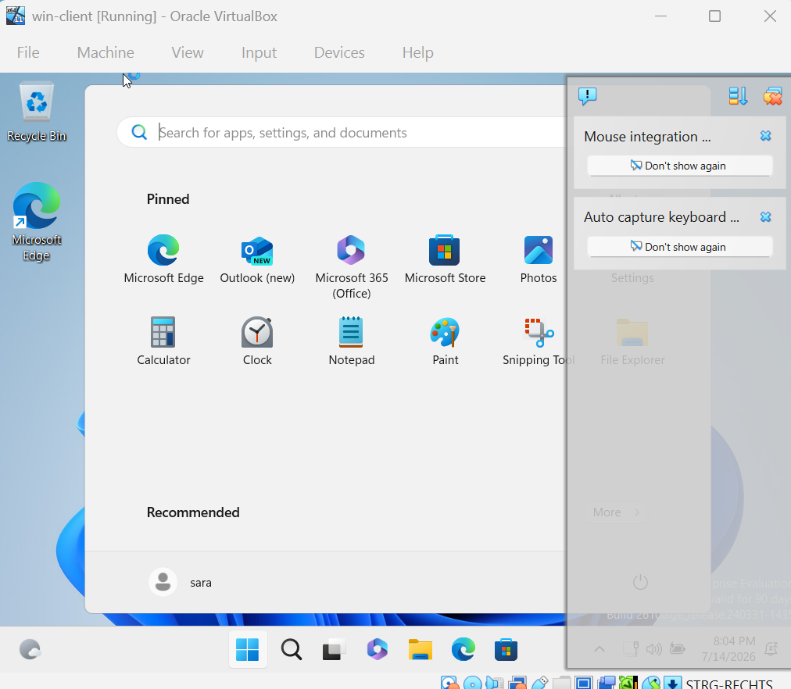
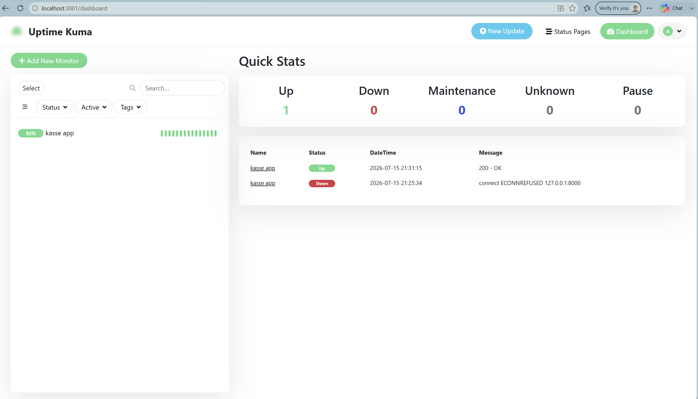
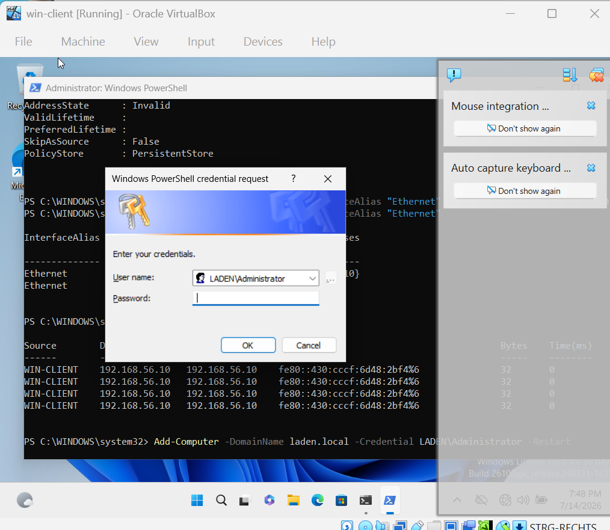

# 🧾 laden-it-lab — Kassensystem als IT-Lernlabor

Ein kleines Kassensystem (Point-of-Sale) — aber eigentlich viel mehr als das:
Dieses Projekt ist mein persönliches IT-Lernlabor im Rahmen meiner Ausbildung
zum **Fachinformatiker Systemintegration**. Statt Systemintegration nur in
der Theorie zu lernen, habe ich mir eine eigene kleine "Firma" gebaut — einen
Laden mit einer echten Kasse — und dann Schritt für Schritt die komplette
IT-Infrastruktur drumherum aufgebaut: vom ersten FastAPI-Prototyp auf dem
eigenen Rechner über einen produktiv betriebenen Linux-Server mit Firewall
und DNS-Namen, ein Helpdesk-System, eine Windows-Domäne mit Active Directory
und Client-Join, bis hin zu automatisierten Backups und Monitoring.

Jeder Schritt ist dokumentiert (siehe [Fortschritt](#-fortschritt)) — inklusive
der Probleme, die aufgetreten sind, und wie ich sie gelöst habe. Genau dieser
Prozess des **Fehler machen → verstehen → lösen** ist für mich der
eigentliche Lerninhalt dieses Projekts.

  

## 📖 Inhalt

- [Funktionen](#-funktionen)
- [Architektur](#-architektur-aktueller-gesamtstand)
- [Umgebung: WSL2 & Virtuelle Maschinen](#-umgebung-wsl2--virtuelle-maschinen)
- [Verwendete Technologien](#-verwendete-technologien)
- [Fortschritt](#-fortschritt)
- [Visuelle Eindrücke](#-visuelle-eindrücke)

## ✨ Funktionen

**Kasse (Point-of-Sale)**
- Artikel auswählen, Warenkorb füllen, Verkauf abschließen
- Artikelverwaltung (Anlegen, Bearbeiten, Löschen) über eine eigene Seite `/artikel`
- Tagesbericht mit Umsatz und Verkaufszahlen, auch für vergangene Tage
- Automatische PDF-Kassenbon-Erstellung nach jedem Verkauf (fpdf2, A6-Format)

**Server & Netzwerk**
- Betrieb als dauerhafter `systemd`-Dienst auf einem Ubuntu-Linux-Server
- Feste IP-Adresse statt DHCP (Netplan)
- Firewall (UFW) mit minimal notwendigen offenen Ports
- Erreichbarkeit über einen Namen (`kasse.laden.local`) statt IP-Adresse

**Helpdesk**
- Eigenes Ticket-System nach ITIL-Grundidee (Titel, Beschreibung, Priorität, Status)
- Seite `/tickets` zum Erstellen und Verfolgen von Tickets

**Active Directory / Nutzerverwaltung**
- Windows Server als Domain Controller für die Domäne `laden.local`
- Sicherheitsgruppen und Benutzer per PowerShell verwaltet (z. B. Gruppe "Kassierer")
- Windows-11-Client erfolgreich der Domäne beigetreten und Login als Domänen-Benutzer

**Backup**
- Tägliches automatisches Backup der Kassen-Datenbank per Cron-Job und Bash-Skript
- Backup/Restore-Prinzip real getestet (Datenbank absichtlich beschädigt und wiederhergestellt)

**Monitoring**
- Uptime Kuma (Docker) überwacht die Kassen-App und meldet Ausfälle

## 🏗️ Architektur (aktueller Gesamtstand)

## 💻 Umgebung: WSL2 & Virtuelle Maschinen

Ein wichtiger Teil dieses Projekts war nicht nur die Anwendung selbst,
sondern **wie und womit** ich sie betrieben habe — das ist genau das, worum
es in der Systemintegration geht.

**WSL2 (Ubuntu unter Windows):** Mein Arbeitsrechner läuft mit Windows,
programmiert und entwickelt habe ich aber in einem echten Linux-Terminal —
über WSL2 (Windows Subsystem for Linux) mit einer Ubuntu-Umgebung. So konnte
ich von Anfang an mit den Werkzeugen arbeiten, die auf einem echten
Linux-Server auch verwendet werden (Bash, `venv`, `systemctl`, `ssh`, `cron`
usw.), ohne dafür einen zweiten physischen Rechner zu brauchen. WSL2 war
außerdem meine "Kommandozentrale": von dort aus habe ich mich per SSH mit
den virtuellen Servern verbunden, Code auf GitHub verwaltet und die
gesamte Projektentwicklung gesteuert.

**VirtualBox (virtuelle Maschinen):** Für die eigentliche Infrastruktur habe
ich Oracle VirtualBox genutzt, um mehrere unabhängige virtuelle Maschinen zu
betreiben:

- Eine **Ubuntu-Server-VM**, auf der die Kassen-App produktiv läuft
  (systemd-Dienst, Firewall, feste IP, Backup, Monitoring).
- Eine **Windows-Server-VM** (Server Core, ohne grafische Oberfläche), die
  ich zum Domain Controller für Active Directory befördert habe.
- Eine **Windows-11-Client-VM**, die ich der Domäne beigetreten habe, um
  einen realistischen Kassen-Arbeitsplatz im Firmennetzwerk nachzustellen.

Dabei habe ich mit unterschiedlichen VirtualBox-Netzwerktypen gearbeitet
(NAT mit Port-Forwarding für den Zugriff vom Windows-Host, Internal Network
für die Kommunikation zwischen den VMs untereinander) und gelernt, wie man
Server komplett ohne grafische Oberfläche allein über die Kommandozeile /
PowerShell administriert. Diese Kombination aus WSL2 als Entwicklungs- und
Steuerungsumgebung und VirtualBox-VMs als realitätsnahe Server- und
Client-Landschaft war für mich der zentrale Lernrahmen für
Systemintegration in diesem Projekt.

## 🛠️ Verwendete Technologien

| Bereich | Technologie |
|---|---|
| Sprache | Python 3 |
| Backend-Framework | FastAPI |
| Datenbank | SQLite |
| PDF-Erzeugung | fpdf2 |
| Server-Betrieb | systemd, Ubuntu Linux |
| Netzwerk | Netplan (feste IP), UFW (Firewall), DNS |
| Nutzerverwaltung | Active Directory, Windows Server (Domain Controller) |
| Client | Windows 11 (Domänen-Client) |
| Backup | Bash, Cron |
| Monitoring | Uptime Kuma (Docker) |
| Virtualisierung | Oracle VirtualBox |
| Entwicklungsumgebung | WSL2 (Ubuntu unter Windows) |
| Versionierung | Git, GitHub |

## 📅 Fortschritt

| Schritt | Thema | Bericht |
|---|---|---|
| 1 | Die Kasse läuft (FastAPI-Grundlagen) | [schritt-01.md](docs/schritt-01.md) |
| 2 | Artikelverwaltung, Tagesbericht, PDF-Kassenbon | [schritt-02.md](docs/schritt-02.md) |
| 3 | Kasse läuft auf einem echten Linux-Server | [schritt-03.md](docs/schritt-03.md) |
| 4 | Feste IP, Firewall (UFW) und DNS-Name | [schritt-04.md](docs/schritt-04.md) |
| 5 | Helpdesk & Ticket-System (ITIL) | [schritt-05.md](docs/schritt-05.md) |
| 6 | Windows Server, Active Directory & Client-Join | [schritt-06.md](docs/schritt-06.md) |
| 7 | Backup-Automatisierung & Monitoring (Uptime Kuma) | [schritt-07.md](docs/schritt-07.md) |
| 8 | Windows-Client als Kassen-Arbeitsplatz & Abschluss-Dokumentation | [schritt-08.md](docs/schritt-08.md) |

Ein wiederholbares Runbook für die wichtigsten Abläufe (neue Kasse
einrichten, Backup zurückspielen) findet sich in [docs/runbook.md](docs/runbook.md).

## 🖼️ Visuelle Eindrücke

  
  

  
  

