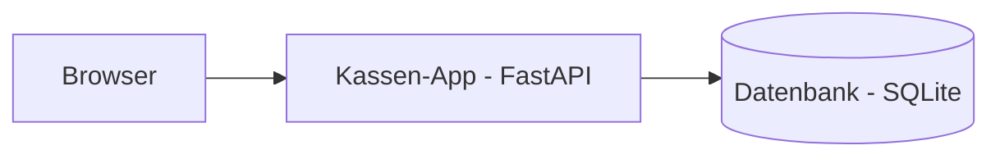

# laden-it-lab

Ein kleines Kassensystem (Point-of-Sale) als Lernprojekt im Rahmen der Ausbildung
zum Fachinformatiker Systemintegration.

## Architektur

## Fortschritt

- [Woche 1 – Die Kasse läuft](docs/woche-01.md)
