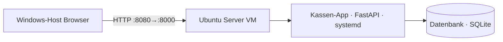

# WOCHE 3 – Die Kasse läuft auf einem Server

**Ziel:** Die Kassen-App vom eigenen PC auf einen echten Linux-Server bringen, sodass sie dauerhaft und unabhängig läuft.

**Gebaut:**
- Ubuntu-Server-VM (kasse-server) in VirtualBox erstellt und per SSH erreichbar gemacht
- Projekt von GitHub auf den Server geklont, Python-Umgebung (venv) eingerichtet, alle Abhängigkeiten installiert
- Die App als systemd-Dienst (kasse.service) eingerichtet, sodass sie automatisch startet und bei einem Absturz neu startet

**Screenshot/Demo:**
- Screenshot der Kasse im Browser unter `localhost:8080`, verbunden mit dem Server
- Screenshot von `sudo systemctl status kasse` mit Status "active (running)"

**Architektur:**

**Gelernt:**
- Umgang mit VirtualBox: VM erstellen, starten, Port Forwarding einrichten
- SSH-Verbindung von WSL zu einer VM über NAT und Port Forwarding
- Wie man eine Python-App als dauerhaften systemd-Dienst betreibt (Service-Datei, daemon-reload, enable, start)

**Problem & Lösung:**
Beim Einrichten des Port Forwarding für die Kassen-App habe ich aus Versehen "800" statt "8000" als Guest Port eingetragen. Die App lief auf dem Server, war aber vom Browser aus nicht erreichbar. Durch genaues Vergleichen der Portnummern in der VirtualBox-Regel habe ich den Tippfehler gefunden und korrigiert – danach funktionierte der Zugriff sofort.

**Nächster Schritt:** Woche 4 – Netzwerk-Grundlagen vertiefen: feste IP für den Server, Firewall-Regeln und einen Namen (DNS) statt der IP-Adresse einrichten.
