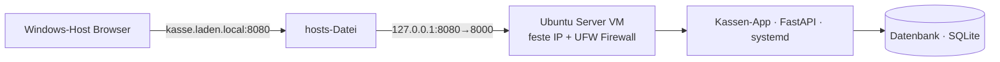

# WOCHE 4 – Netzwerk, Ports & Namen (DNS)

**Ziel:** Verstehen, wie Geräte sich im Netzwerk finden, und die Kasse über einen Namen statt einer IP-Adresse erreichen.

**Gebaut:**
- Dem Server eine feste IP-Adresse gegeben (Netplan-Konfiguration statt DHCP)
- Firewall (UFW) eingerichtet: nur die Ports 22 (SSH) und 8000 (Kasse) sind erlaubt
- Einen lokalen Namen (kasse.laden.local) über die Windows-hosts-Datei eingerichtet

**Screenshot/Demo:**
- Screenshot der Kasse im Browser unter `kasse.laden.local:8080`
- Screenshot von `sudo ufw status` mit den aktiven Firewall-Regeln

**Architektur:**

**Gelernt:**
- Was IP-Adressen, Ports und DNS bedeuten und wie sie zusammenspielen
- Wie man mit Netplan eine feste IP-Adresse statt DHCP konfiguriert
- Wie man mit UFW eine einfache Firewall einrichtet und nur bestimmte Ports freigibt
- Wie die Windows-hosts-Datei genutzt wird, um lokale Namen aufzulösen

**Nächster Schritt:** Woche 5 – Helpdesk & Tickets: ein einfaches Ticket-System nach ITIL-Grundlagen in die Kassen-App einbauen.
