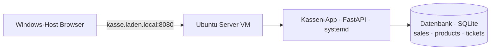

# WOCHE 5 – Helpdesk & Tickets (ITIL)

**Ziel:** Ein einfaches Ticket-System in die Kassen-App einbauen, um IT-Probleme zu melden und zu verfolgen.

**Gebaut:**
- Neue Datenbank-Tabelle `tickets` (Titel, Beschreibung, Priorität, Status)
- Neue API-Endpunkte: Tickets auflisten, neues Ticket erstellen, Status ändern
- Neue Seite `/tickets` mit Formular für neue Tickets und einer Übersicht aller Tickets

**Screenshot/Demo:**
- Screenshot der Tickets-Seite im Browser mit einem erstellten Ticket

**Architektur:**

**Gelernt:**
- Was ein Ticketsystem ist und die ITIL-Grundidee: Incident, Priorität, Status (offen → in Bearbeitung → gelöst)
- Wie man eine neue Datenbank-Tabelle und passende API-Routen in FastAPI ergänzt, ohne bestehenden Code zu brechen
- Wie man eine neue HTML/JS-Seite im gleichen Stil wie bestehende Seiten aufbaut

**Problem & Lösung:**
Nach dem Hinzufügen der neuen `tickets`-Tabelle in `database.py` startete der Dienst nicht mehr (IndentationError). Mit `sudo journalctl -u kasse` habe ich die genaue Zeile gefunden: eine `connection.execute(`-Zeile hatte keine Einrückung. Nach dem Korrigieren der Einrückung lief der Dienst wieder fehlerfrei.

**Nächster Schritt:** Woche 6 – Windows Server & Active Directory: eine zentrale Nutzerverwaltung für das "Ladenpersonal" einrichten.
