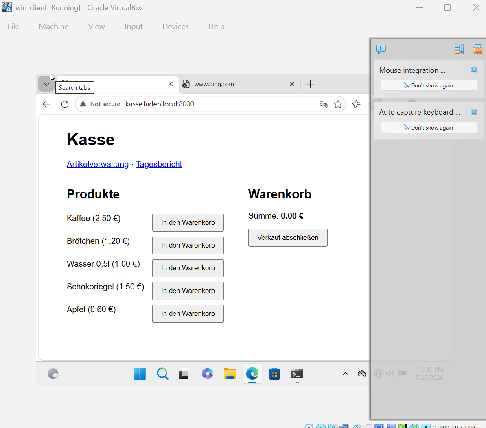
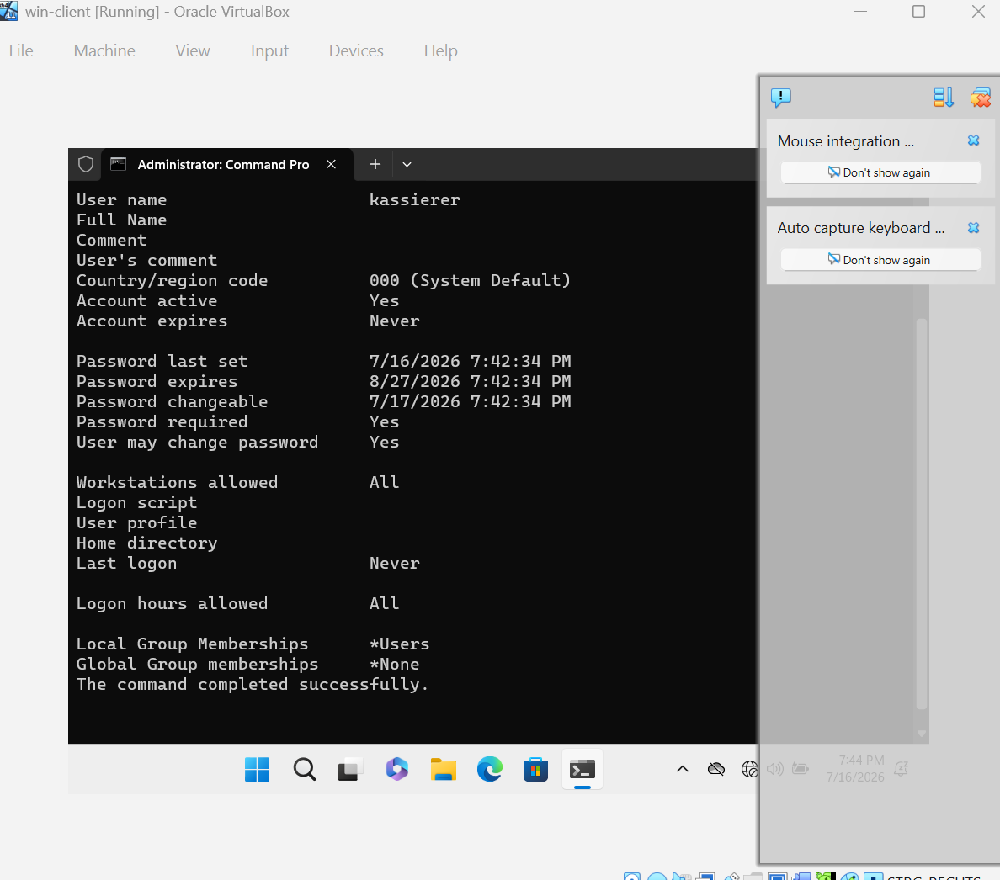
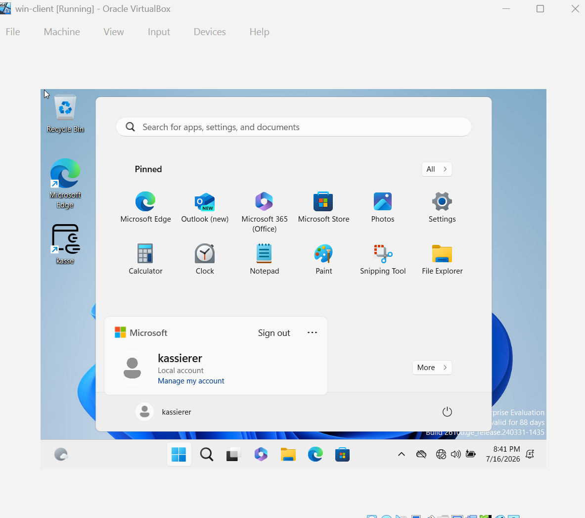
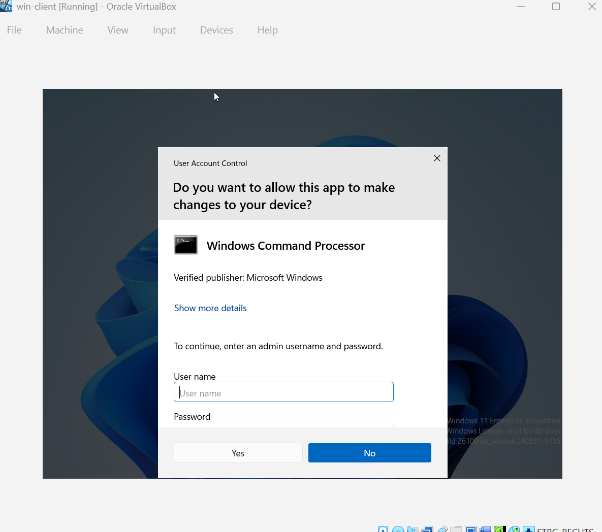

# WOCHE 8 – Windows-Client als Kassen-Arbeitsplatz & Abschluss-Dokumentation

**Ziel:** Einen Windows-Client als echten Kassen-Arbeitsplatz einrichten — mit
direktem Zugriff auf die Kasse und einem eingeschränkten Benutzer ohne
Admin-Rechte (Least Privilege) — sowie das Projekt mit einem Runbook
abschließend dokumentieren.

**Gebaut:**
- Windows-Client-VM als Kassen-Arbeitsplatz eingerichtet, mit einer
  Browser-Verknüpfung auf dem Desktop zu `http://kasse.laden.local:8000`
- Eingeschränkten lokalen Benutzer `kassierer` (ohne Admin-Rechte, nur in
  Gruppe "Users") auf dem Windows-Client erstellt und getestet
- Getestet, dass Windows bei einem Versuch, eine Admin-Aktion auszuführen,
  korrekt ein Admin-Passwort verlangt (Prinzip der minimalen Rechte /
  Least Privilege)
- Ein Netzwerkproblem gelöst, durch das der Windows-Client die Kasse zunächst
  nicht erreichen konnte (siehe Problem & Lösung)
- `docs/runbook.md` geschrieben: Ablauf "Neue Kasse einrichten" und
  "Backup zurückspielen"

**Screenshot/Demo:**

  
  

  
  

**Architektur:** siehe Diagramm im README — der Windows-Client ist jetzt kein
reiner Domain-Login-Client mehr, sondern der eigentliche
Kassen-Arbeitsplatz: Browser-Zugriff auf `kasse.laden.local:8000` läuft über
den zweiten Netzwerkadapter des Ubuntu-Servers im Internal Network
`labornetz`, nicht mehr nur über NAT.

**Gelernt:**
- Windows-Benutzerverwaltung mit lokalen Konten (`net user`) und der
  Unterschied zwischen Gruppenmitgliedschaft "Users" und "Administrators"
- User Account Control (UAC) als praktische Umsetzung von Least Privilege:
  ein eingeschränkter Benutzer kann Software sehen und benutzen, aber keine
  systemverändernden Aktionen ohne Admin-Passwort durchführen
- VirtualBox-Netzwerkadapter: der Unterschied zwischen NAT (nur Zugriff nach
  außen, keine feste interne Erreichbarkeit) und Internal Network (VMs
  können sich untereinander direkt erreichen)
- Dass eine VM mehrere Netzwerkadapter gleichzeitig haben kann, die
  unterschiedliche Zwecke erfüllen (hier: NAT für Internetzugriff der VM
  selbst, Internal Network für die Kommunikation mit den anderen
  Labor-VMs)
- Wie wichtig ein Runbook ist: Wissen, das während der Fehlersuche entsteht,
  muss danach in Schritt-für-Schritt-Anleitungen festgehalten werden, sonst
  geht es beim nächsten Mal wieder verloren

**Problem & Lösung:**

Der Windows-Client konnte die Kasse unter `kasse.laden.local:8000`
zunächst überhaupt nicht erreichen — der Browser zeigte einen
Verbindungsfehler, obwohl die Kassen-App auf dem Ubuntu-Server
(`kasse-server`) laut `systemctl status kasse` einwandfrei lief.

Die Fehlersuche ergab: Der Ubuntu-Server hatte in VirtualBox bis dahin nur
einen einzigen Netzwerkadapter vom Typ **NAT**. Ein NAT-Adapter erlaubt der
VM zwar, selbst nach außen (Internet) zu kommunizieren, macht die VM aber
für andere VMs im selben Labor-Netzwerk **nicht** direkt erreichbar — jede
VM sitzt dabei quasi in ihrem eigenen isolierten NAT-Netz. Der
Windows-Client (im Internal Network `labornetz`, wie schon in Woche 6 für
Windows Server und Windows-Client eingerichtet) hatte deshalb schlicht
keinen Weg zum Ubuntu-Server, egal wie der DNS-Name aufgelöst wurde.

Die Lösung bestand aus drei Schritten:

1. **Zweiten Netzwerkadapter hinzugefügt:** In den VirtualBox-Einstellungen
   von `kasse-server` einen zweiten Adapter vom Typ **Internal Network**
   (`labornetz`) ergänzt — zusätzlich zum bestehenden NAT-Adapter. Der
   Server ist damit jetzt gleichzeitig im NAT-Netz (für eigenen
   Internetzugriff, z. B. `apt update`) und im Labor-Netzwerk zusammen mit
   Windows Server und Windows-Client.
2. **Feste IP im Labor-Netzwerk vergeben:** Über Netplan dem neuen Adapter
   die statische IP `192.168.56.30` zugewiesen, passend zum Adressschema
   des `labornetz` (Windows Server: `.10`, Windows-Client: `.20`).
3. **DNS-Eintrag ergänzt:** Auf dem Windows Server (`win-server`, DNS-Server
   der Domäne) einen neuen A-Record `kasse` → `192.168.56.30` angelegt, so
   dass `kasse.laden.local` jetzt auf die richtige, im Labor-Netzwerk
   erreichbare IP zeigt.

Nach diesen drei Schritten war die Kasse vom Windows-Client aus unter
`kasse.laden.local:8000` erreichbar. Die zentrale Erkenntnis: NAT und
Internal Network erfüllen unterschiedliche Zwecke und schließen sich nicht
aus — ein Server kann und sollte in einem Lab-Setup oft beide gleichzeitig
haben, je nachdem ob er selbst nach außen oder von anderen VMs erreichbar
sein muss.

**Nächster Schritt:** Projekt ist mit Woche 8 inhaltlich abgeschlossen.
Mögliche Erweiterungen für die Zukunft: HTTPS statt HTTP für die Kasse,
zentrale Log-Auswertung über alle VMs hinweg, weitere Kassierer-Konten mit
Gruppenrichtlinien (GPO) statt einzelner lokaler Benutzer.
